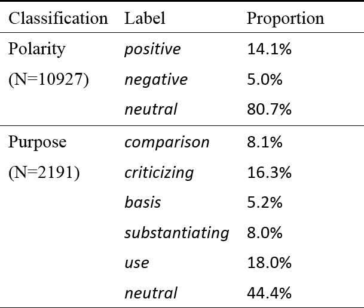

# Title
Citation Purpose and Polarity Classification using CNN and RNN. It's a course project of BME595 deep learning.

## Team members
Gaoping Huang (gaopinghuang0), Meng-Han Wu (wumenghan)

Slides: [Course Project Report](https://docs.google.com/presentation/d/12daPEMI-hLMMk9SDbsUkmN1Q5nZRRUuMoo1lDe1U150/edit?usp=sharing)

## Goals
Our goal is to classify the *purpose* and *polarity* of citations given a citation sentence. Citation polarity has 3 classes, such as positive, negative, and neutral, while citation purpose has 6 classes, representing the author’s intuition behind choosing a publication, such as criticizing and comparison.

## Challenges
1. Prepare dataset
2. Use RNN/CNN to do citation classification 

## Work partition
* Gaoping Huang: building CNN and RNN models
* Meng-Han Wu: adjusting hyperparams and training GloVe on different corpus.
